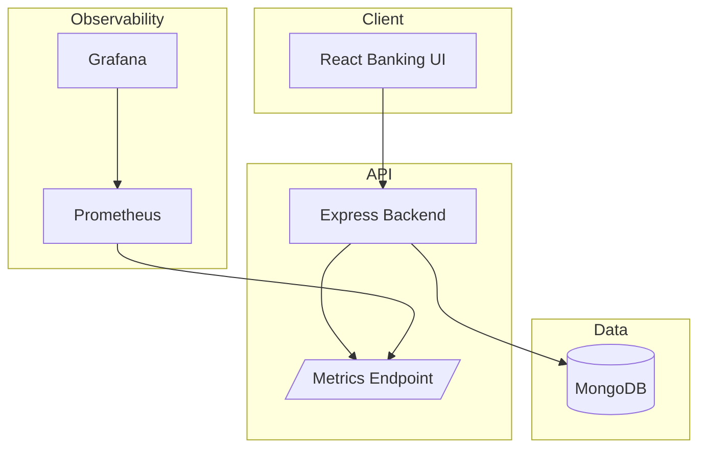

# NexBank Project Documentation

## Final Submission Links

- [Week 4 Monitoring, Optimization, and Presentation](week4-monitoring.md)
- [Kubernetes Deployment Notes](../k8s/README.md)
- [Main Project README](../README.md)

## System Diagram

Use GitHub Pages with the repository `docs/` folder as the publishing source to share this documentation as a simple project site.
