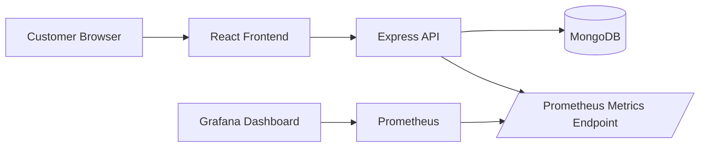

# Week 4 Monitoring, Optimization, and Presentation

## Observability Overview

NexBank now exposes Prometheus-compatible backend metrics at:

```text
http://localhost:5000/metrics
```

The Docker Compose stack includes:

- Prometheus at `http://localhost:9090`
- Grafana at `http://localhost:3001`
- Grafana login: `admin` / `admin`
- Pre-provisioned dashboard: `NexBank / NexBank API Observability`

## Architecture Diagram



## Metrics Collected

| Metric | Type | Purpose |
| --- | --- | --- |
| `nexbank_api_uptime_seconds` | Gauge | Shows API process uptime. |
| `nexbank_http_requests_total` | Counter | Tracks request volume by method, route, and status code. |
| `nexbank_http_request_duration_seconds` | Histogram | Tracks API latency by method, route, and status code. |
| `nexbank_transactions_total` | Counter | Tracks transaction volume by transaction type, status, and route. |

## Dashboard Panels

The Grafana dashboard includes:

- API latency by route using p50 and p95 latency.
- API request rate grouped by route and status code.
- Transaction volume by type.
- Transaction activity by status.

## Runbook

Start the complete stack:

```bash
docker compose up --build
```

Open the services:

```text
Frontend:   http://localhost:3000
Backend:    http://localhost:5000/healthz
Metrics:    http://localhost:5000/metrics
Prometheus: http://localhost:9090
Grafana:    http://localhost:3001
```

Prometheus target check:

1. Open `http://localhost:9090/targets`.
2. Confirm the `nexbank-api` target is `UP`.
3. Query `nexbank_http_requests_total` in the Prometheus graph page.

Grafana dashboard check:

1. Open `http://localhost:3001`.
2. Log in with `admin` / `admin`.
3. Open `Dashboards` > `NexBank` > `NexBank API Observability`.
4. Refresh the frontend and perform a banking action to generate live traffic.

## Testing and Performance Tuning

Automated checks:

```bash
npm test --prefix server
npm test --prefix client -- --watchAll=false
npm run build --prefix client
docker compose config
```

Performance tuning notes:

- Request latency is measured with a histogram so slow routes can be identified by p95 latency rather than averages only.
- Transaction counters separate business activity from generic HTTP request traffic.
- Docker health checks keep dependent services from starting before MongoDB and the API are ready.
- The frontend is built as static assets and served through Nginx in the production container.
- Kubernetes manifests use readiness and liveness probes for backend availability.
- The Kubernetes backend service includes Prometheus scrape annotations for clusters that support annotation-based discovery.

## Demo Video Outline

Recommended Loom recording length: 3 to 5 minutes.

1. Show the running frontend and complete a quick login or banking workflow.
2. Open `/metrics` and point out the Prometheus metric names.
3. Open Prometheus targets and confirm `nexbank-api` is `UP`.
4. Open Grafana and show API latency plus transaction volume panels.
5. Show the repository folders: `monitoring`, `server/metrics.js`, `docker-compose.yml`, and this documentation.
6. Close with the IBM-aligned skills gained: monitoring, cloud-native service health, DevOps automation, API performance analysis, and professional technical communication.

## IBM-Aligned Skills Reflection

This week strengthened practical skills aligned with cloud-native development:

- Observability: instrumenting services, exposing metrics, and building dashboards.
- Application monitoring: tracking latency, request rates, and business transactions.
- DevOps: running repeatable local infrastructure with Docker Compose.
- Reliability: using health checks, probes, and measurable performance signals.
- Professional communication: documenting architecture, runbooks, and demo evidence.
